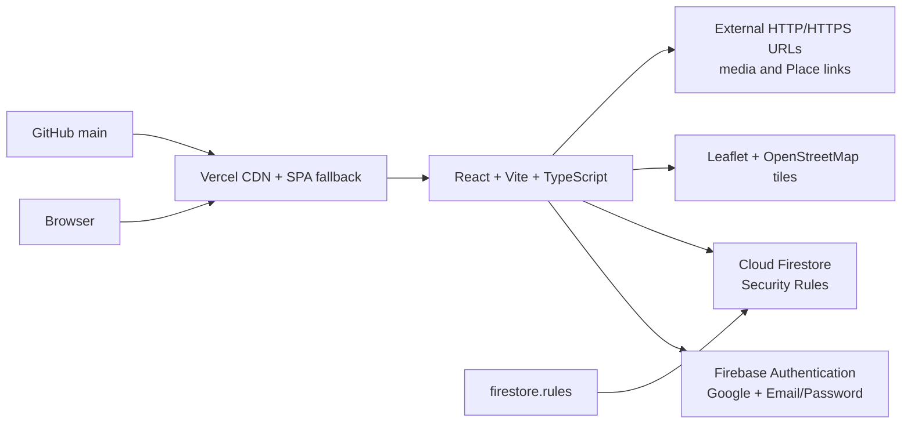

# Arquitetura do BrazilBR

**Escopo:** frontend SPA estático com autenticação e persistência diretamente no Firebase. Não existe backend próprio no repositório.

## Visão geral



A aplicação é um cliente web. O browser carrega o bundle Vite pelo Vercel, inicializa o Firebase quando as variáveis públicas estão presentes e executa operações de Auth/Firestore com as credenciais da sessão. O controle de acesso não está no frontend: ele é feito em [`firestore.rules`](../firestore.rules). O mapa usa Leaflet e tiles do OpenStreetMap; o produto não usa Google Maps API.

O pré-renderizador [`scripts/prerender-seo.tsx`](../scripts/prerender-seo.tsx) gera HTML inicial para a home e as landings SEO públicas durante `bun run build`. A navegação posterior continua sendo controlada manualmente por [`src/App.tsx`](../src/App.tsx) com History API e o fallback do [`vercel.json`](../vercel.json).

## Stack versionada

| Camada | Tecnologia | Papel |
|---|---|---|
| UI | React 19 | Componentes e estados de interface. |
| Build | Vite 6.4.3 | Dev server, bundle e preview. |
| Linguagem | TypeScript 5.8 | Tipos e verificação `tsc --noEmit`. |
| Estilo | Tailwind CSS 4 + `@tailwindcss/vite` | CSS utilitário e design responsivo. |
| Ícones | `lucide-react` | Ícones de interface. |
| Movimento | `motion` está disponível no manifesto, mas não é importado pelo runtime atual. | Dependência a revisar antes de remover. |
| Auth | `@firebase/app`, `@firebase/auth` | Firebase App, Google Auth e Email/Password. |
| Banco | `@firebase/firestore` | Cloud Firestore pelo SDK cliente. |
| Mapa | Leaflet 1.9.4 + OpenStreetMap | Mapa comunitário e marcadores city-level. |
| SEO | React metadata + pré-render customizado | HTML inicial, canonical, OG, JSON-LD, sitemap e robots. |
| Hospedagem | Vercel | CDN, build automático, headers e fallback SPA. |
| Código | GitHub | Fonte, histórico, revisão e recuperação. |

O manifesto também contém `@google/genai`, `dotenv`, `express`, `autoprefixer` e `esbuild`, mas eles não são importados pelo runtime observado. Não remova dependências não utilizadas sem primeiro confirmar a origem do manifesto, atualizar o lockfile e executar build em uma branch separada.

## Estrutura de pastas

```text
.
├── README.md
├── docs/
├── public/
│   ├── robots.txt
│   └── sitemap.xml
├── scripts/
│   └── prerender-seo.tsx
├── src/
│   ├── main.tsx
│   ├── App.tsx
│   ├── index.css
│   ├── seo.ts
│   ├── types.ts
│   ├── context/
│   │   └── AuthContext.tsx
│   ├── components/
│   │   ├── WelcomeScreen.tsx
│   │   ├── OnboardingScreen.tsx
│   │   ├── HomeScreen.tsx
│   │   ├── DiscoverScreen.tsx
│   │   ├── MapScreen.tsx
│   │   ├── PlaceProfileScreen.tsx
│   │   ├── ProfileScreen.tsx
│   │   ├── MyProfileScreen.tsx
│   │   ├── FeedScreen.tsx
│   │   ├── ContributionsScreen.tsx
│   │   ├── MessagesScreen.tsx
│   │   ├── ConversationScreen.tsx
│   │   ├── FriendsScreen.tsx
│   │   ├── GroupsScreen.tsx
│   │   ├── NotificationsScreen.tsx
│   │   ├── SearchScreen.tsx
│   │   ├── PrimaryNav.tsx
│   │   ├── ExternalMediaPreview.tsx
│   │   ├── FirebaseSetupBanner.tsx
│   │   ├── SeoHead.tsx
│   │   └── SeoLandingPage.tsx
│   └── firebase/
│       ├── config.ts
│       ├── auth.ts
│       ├── userProfile.ts
│       ├── discovery.ts
│       ├── connections.ts
│       ├── messages.ts
│       ├── posts.ts
│       ├── contributions.ts
│       ├── places.ts
│       ├── publishing.ts
│       ├── media.ts
│       ├── notifications.ts
│       ├── groups.ts
│       ├── search.ts
│       └── safety.ts
├── firebase.json
├── .firebaserc
├── firestore.rules
├── vercel.json
├── package.json
└── bun.lock
```

## Bootstrap e roteamento

[`src/main.tsx`](../src/main.tsx) localiza `#root` e renderiza `<App />` dentro de `StrictMode`. [`App.tsx`](../src/App.tsx) envolve o app com `AuthProvider`, acompanha `popstate`, normaliza paths conhecidos e aplica a seguinte ordem:

| Condição | Tela |
|---|---|
| Path SEO público diferente de `/` | `SeoLandingPage` sem autenticação. |
| Auth carregando ou usuário autenticado com profile carregando | Loader de bootstrap. |
| Usuário anônimo | `WelcomeScreen`; uma rota protegida volta para `/`. |
| Usuário autenticado sem onboarding | `/onboarding`. |
| Usuário autenticado com onboarding completo em `/` ou `/onboarding` | `/home`. |
| Usuário autenticado | Tela correspondente a `/map`, `/place`, `/discover`, `/profile`, `/messages`, `/conversation`, `/groups`, `/search`, `/contribute`, `/notifications` ou `/friends`. |

A rota `/place` usa `placeId` ou `id` na query string; `/profile` usa `uid`; `/conversation` usa `id`. Os valores devem continuar sendo codificados com `encodeURIComponent` nos links internos.

## Fluxo de dados

O fluxo de autenticação é: Firebase Auth → `onAuthStateChanged` → `syncUserProfile` → `profileLoading=false` → guard de onboarding → app. O perfil privado fica em `users/{uid}`; a projeção pública fica em `publicProfiles/{uid}`; o contexto atual fica em `userContext/{uid}`.

As telas não devem chamar Firestore diretamente. Cada domínio deve passar por seu módulo em `src/firebase/`. Esse limite concentra normalização, tratamento de erros e nomes de coleções. Operações compostas que alteram mais de um documento devem usar `writeBatch` ou transação; o padrão pode ser consultado em onboarding, mensagens, comentários e publicação de Place + Contribution.

## Boundary de mídia

`src/firebase/media.ts` é deliberadamente uma boundary de referências externas. Ela aceita somente URLs `http` ou `https`, limita o comprimento e cria `MediaReference` sem path, bucket, download ou proxy. `ExternalMediaPreview` mostra loading/fallback e abre links com `target="_blank" rel="noopener noreferrer"`.

Essa decisão é estrutural: **não existe Firebase Storage no runtime atual**. Caso o produto passe a armazenar binários, é necessário um ADR novo, análise de custos, migração de dados, atualização de Rules, privacy review e testes de recuperação.

## Dependências entre serviços

O Vercel não hospeda o banco nem a autenticação. O Firebase não publica o frontend. Um deploy de código acontece por GitHub → Vercel; um deploy de Rules acontece separadamente por Firebase CLI/Console. Se Vercel estiver funcionando e o Firestore estiver com Rules antigas, o bundle pode carregar e as writes ainda falharem. Esse desacoplamento deve aparecer em qualquer incidente.

## Invariantes arquiteturais

O projeto deve continuar sendo uma SPA Vite sem servidor próprio; o entrypoint deve manter `#root`; `AuthProvider` deve inicializar antes das telas; o app não pode montar telas autenticadas antes de `profileLoading` terminar; dados privados devem permanecer atrás de Rules; `main` é a origem do Production Vercel; o fallback SPA deve permanecer; e o mapa deve manter atribuição e política compatíveis com OpenStreetMap.

## Referências

[1]: https://firebase.google.com/docs/auth/web/start "Firebase Authentication for Web"
[2]: https://firebase.google.com/docs/firestore/security/get-started "Cloud Firestore Security Rules"
[3]: https://vite.dev/guide/ "Vite Guide"
[4]: https://vercel.com/docs/deployments/git "Vercel Git deployments"
[5]: https://operations.osmfoundation.org/policies/tiles/ "OpenStreetMap Tile Usage Policy"
