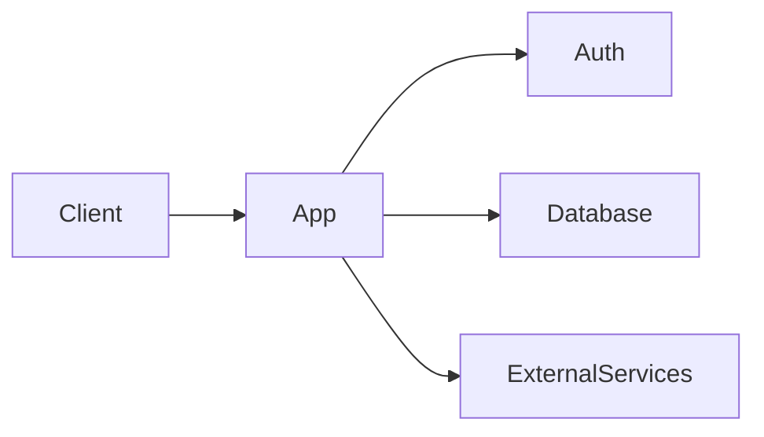

# Technical Specification

- **Product/version/owner:**
- **Decision date:**
- **Environment(s):**
- **Cost ceiling:**

## Architecture diagram

## Stack and rationale

## Frontend/backend boundary

## Data model, ownership and migrations

## Auth and authorization

## APIs and external integrations

## Environment variables and secret handling

## Hosting, build and deploy

## Backups, recovery and rollback

## Threats and mitigations

## Dependency and cost register

| Dependency/service | Purpose | Required? | Cost risk | Owner | Exit path |
|---|---|---:|---|---|---|

## Tests and acceptance evidence

## Alternatives rejected
